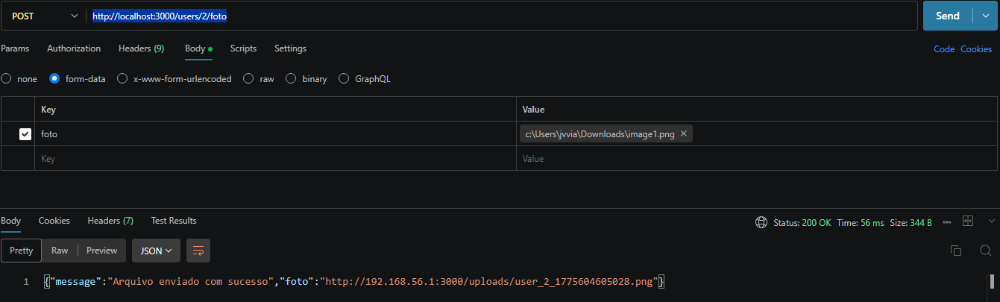

# Informações uteis para rodar a API
## Precisa criar um dotenv nesse modelo

DB_HOST=localhost
DB_USER=usuario do banco
DB_PASSWORD=senha do banco
DB_NAME=db_barbearia_avenida

BASE_URL=http://ip da maquina:porta padrao
EX:
    BASE_URL=http://192.168.111.111:3000 -> isso aqui vai ser necessário pra funcionar a busca da foto pra carregar em tela.
PORT=porta pra subir a api

---

# Rota padrão pra consulta
## Criação de usuário:
POST: http://localhost:3000/users
### formato arquivo JSON:
{
 "nome":"João Victor Viana",
 "nome_usuario":"JoãoViana96",
 "email":"joao.teste@gmail.com",
 "celular":"19988880000",
 "senha":"123456"
}
### Retorno:
{
    "id_usuario": 1,
    "nome": "João Victor Viana",
    "nome_usuario": "JoãoViana96",
    "email": "joao.teste@gmail.com"
}

--- 

## Rota de Login
POST:  http://localhost:3000/login
### formato de arquivo JSON
{
 "nome_usuario":"JoãoViana96",
 "senha":"123456"
}
### Retorno:
{
"message":"Login efetuado com sucesso",
    "user":
    {
        "id":1,
        "nome":"joaovictor",
        "email":"joao.teste@gmail.com"
    }
}

---

## Rota de servicos
GET:  http://localhost:3000/services
### formato de arquivo JSON
não é necessário enviar nada
### Retorno:
[
    {
        "id_servico": 1,
        "nome": "corte cabelo",
        "valor": "40.00",
        "duracao_minutos": 40
    },
    {
        "id_servico": 2,
        "nome": "corte cabelo",
        "valor": "40.00",
        "duracao_minutos": 40
    },
    {
        "id_servico": 3,
        "nome": "barba",
        "valor": "25.00",
        "duracao_minutos": 30
    },
    {
        "id_servico": 4,
        "nome": "sobrancelha",
        "valor": "10.00",
        "duracao_minutos": 5
    },
    {
        "id_servico": 5,
        "nome": "descoloração",
        "valor": "80.00",
        "duracao_minutos": 90
    },
    {
        "id_servico": 6,
        "nome": "pigmentacao cabelo",
        "valor": "30.00",
        "duracao_minutos": 20
    },
    {
        "id_servico": 7,
        "nome": "pigmentacao barba",
        "valor": "20.00",
        "duracao_minutos": 15
    }
]

---

## Rota de formas de pagamento
GET:  http://localhost:3000/payments
### formato de arquivo JSON
não é necessário enviar nada
### Retorno:
[
    {"id_forma_pagamento":1,"nome":"crédito"},
    {"id_forma_pagamento":2,"nome":"débito"},
    {"id_forma_pagamento":3,"nome":"dinheiro"},
    {"id_forma_pagamento":4,"nome":"pix"}
]

---

## Rota de upload de imagens (foto)
POST:  http://localhost:3000/users/'id do usuário'/foto
### formato de arquivo JSON
Precisa enviar a imagem nesse esquema abaixo

### Retorno:
{"message":"Arquivo enviado com sucesso","foto":"http://192.168.56.1:3000/uploads/user_2_1775604605028.png"}

---

SUBIR REPOSITORIO PARA O GIT NA PASTA SRC
UMA PASTA PARA A API
UMA PASTA PARA O DUMP DO BANCO

### proximas rotas

* editar perfil (reenviar todos os campos independente de serem alterados)

* pensar em como vai ser a questão do agendamento. 

* historico (criar uma view bem estruturada com informações essenciais)

---

